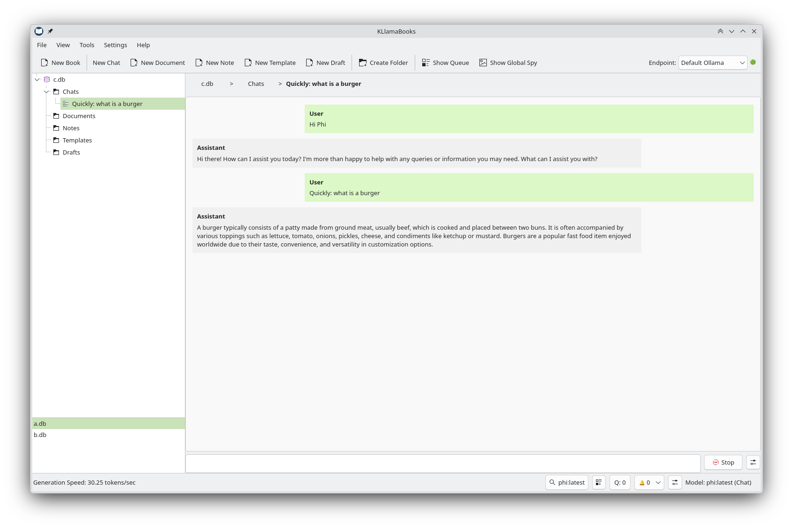
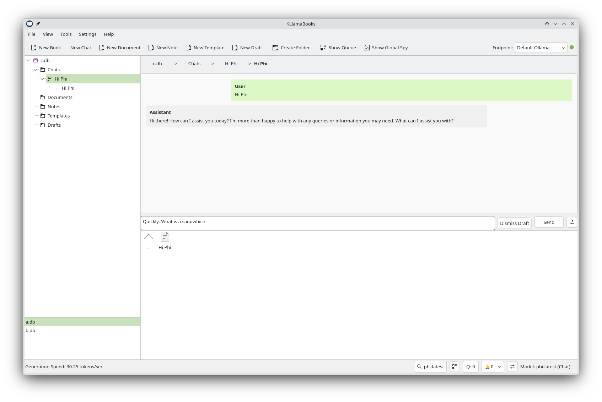
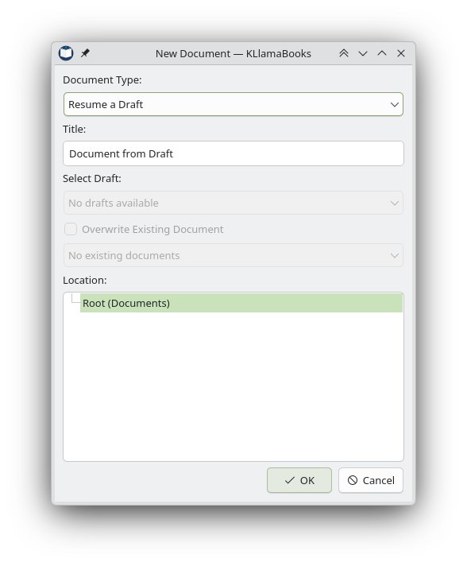
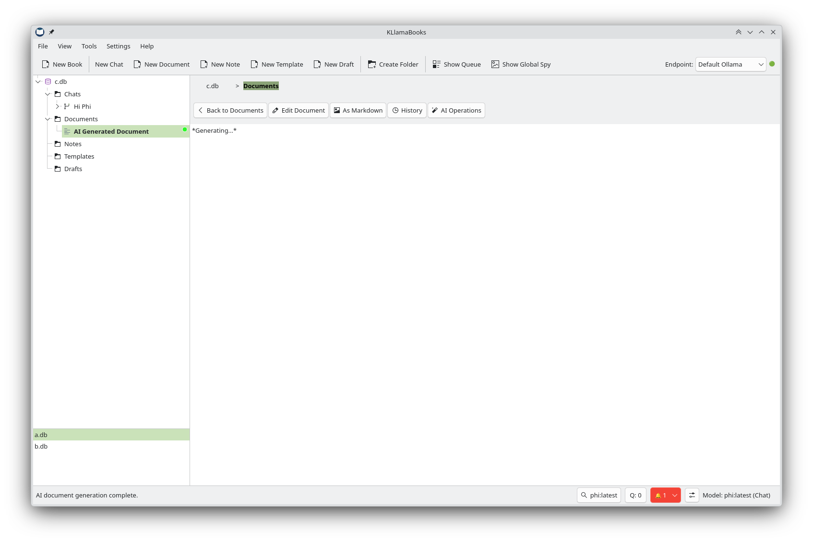
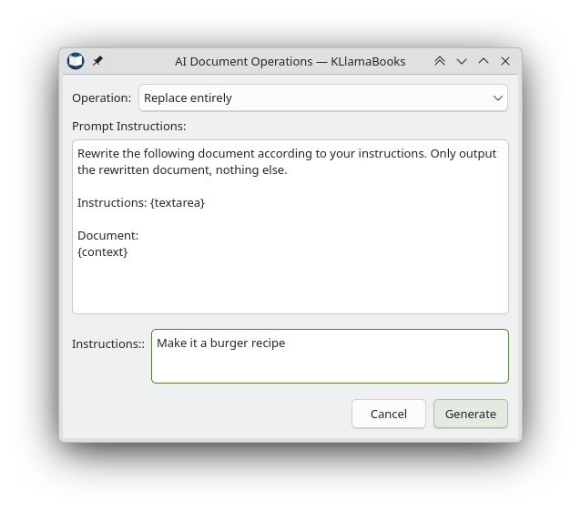
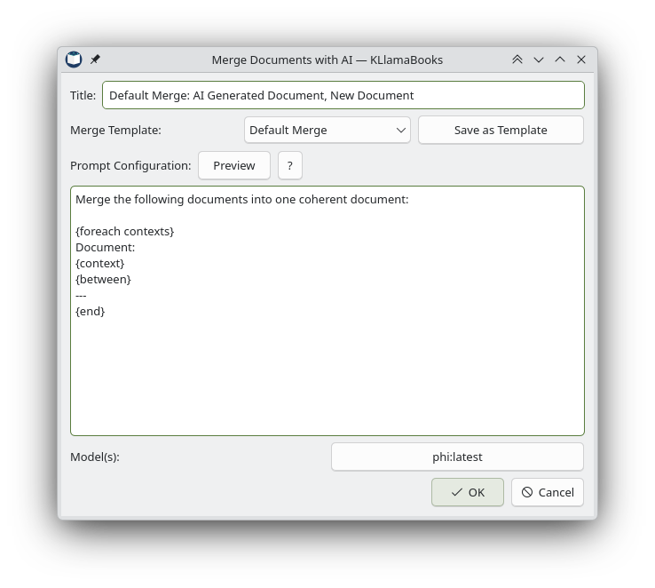

# KLlamaBooks
A KDE-styled QT application that interacts with local Ollama sessions and stores chat history locally via encrypted SQLite databases.



## Features

### Chat with AI
Enjoy a full-featured chat interface directly interacting with your local Ollama models. Support for branching chats, editing history, and maintaining an organized notebook of your interactions.



### Create AI Documents
Generate completely new documents, notes, or templates with custom prompts to jumpstart your writing process. Documents are saved natively into your notebooks.





### AI Document Operations
Select documents and perform AI operations like summarization, rewriting, or extracting information directly on the text using a simple interface. Custom prompt instructions can be easily defined.



### Merge Documents with AI
Allows selecting multiple documents in the VFS explorer (by holding `Ctrl` or `Shift`) and opening a context menu to "Merge Documents with AI...".


This feature uses a custom templating language to control how the documents are merged into the final AI prompt.

**Template Language Tags:**
* `{foreach contexts} ... {end}`: Loops over every selected document and executes the inner template.
* `{context}`: Used inside a foreach loop to represent the content of the current document.
* `{between}`: Defines the separator between documents. Anything after `{between}` inside the loop will only be inserted between items.

**Template Example:**
```
Merge these files:

{foreach contexts}
# File
{context}
{between}

---

{end}
```

This renders to:
```
Merge these files:

# File
(Content 1)

---

# File
(Content 2)
```

You can also use `{input "Label"}` or `{textarea "Label"}` anywhere in the prompt to dynamically ask the user for context during generation.
